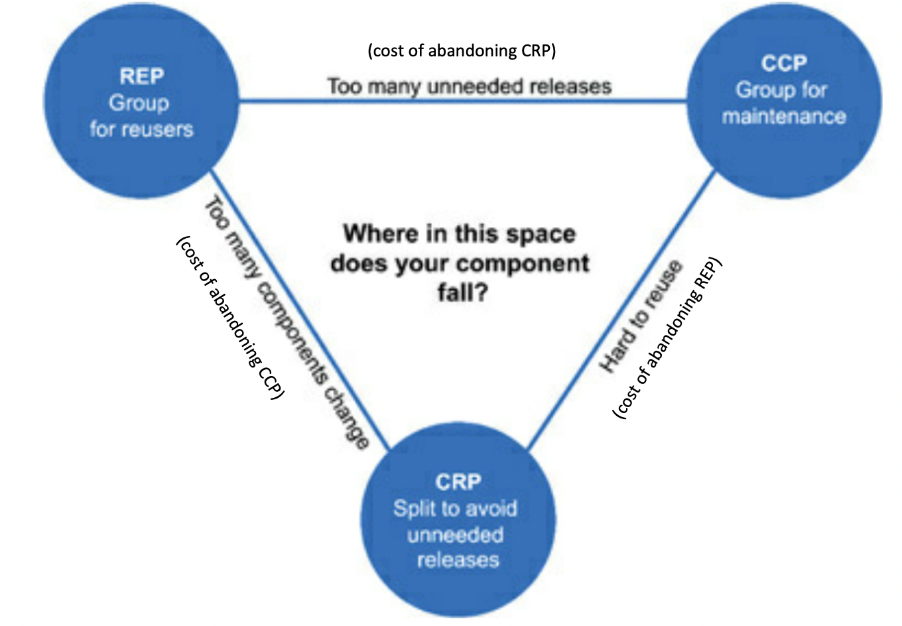
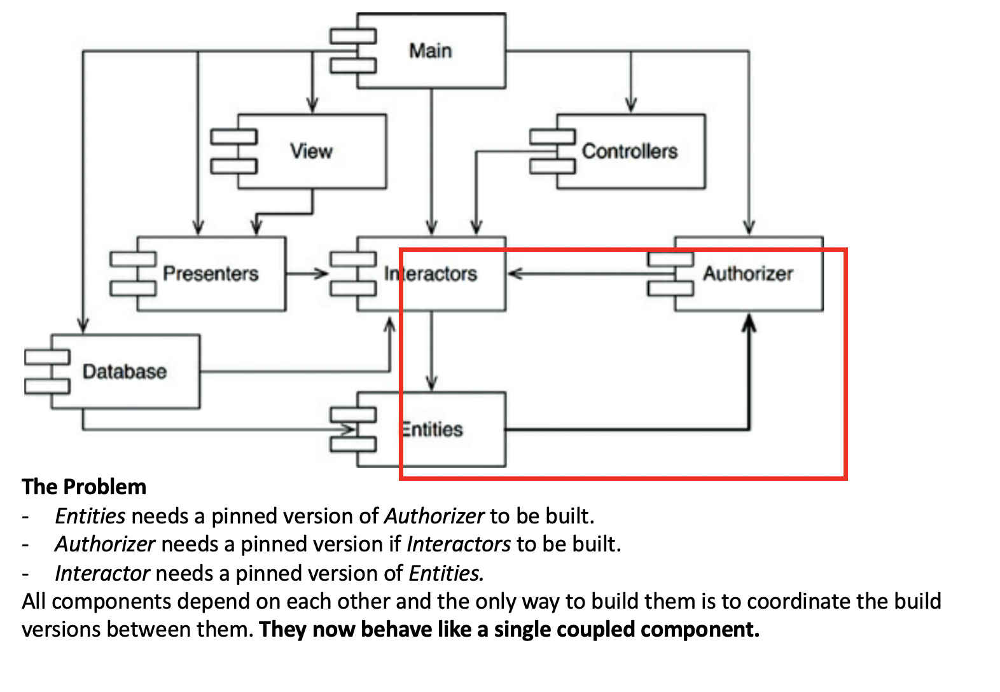
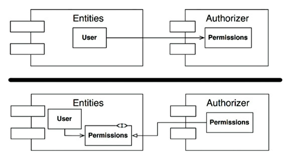
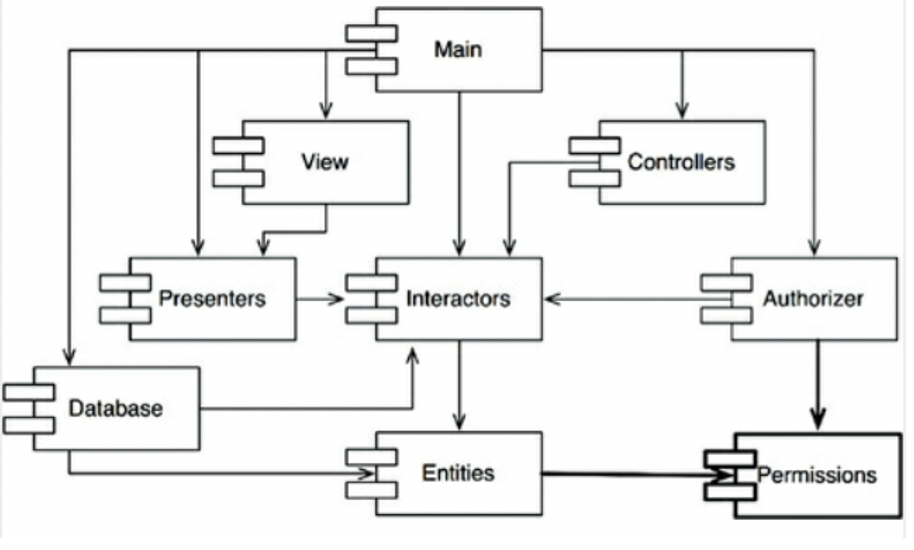

# Part IV - Component Principles

The [SOLID design principles in part III](part-3-design-principles.md)
showed us how to arrange code into classes / modules and how to
interconnect those classes.

Part IV will go one level up to show us what **components** are, how to
compose them and how they should interact in a system.


## Chapter 12 - What Components Are

Components are units of deployment. Jar files in Java, Gems in Ruby,
DLLs in .Net.

Good component design retains **independence of deployability and
independence of developability.**


## Chapter 13 - Component Cohesion Principles

Component cohesion is about answering the question: **Which classes
belong in which components?**. This is usually done in an ad-hoc manner,
but there are software engineering principles that can guide the
decision.

### The Reuse / Release Equivalence Principle (REP)

A component should be deployable **as a whole** and independent from
other components. The deployment of a component will therefore have a
*release number* (e.g. semantic version), withs its corresponding
*release documentation.* This allow developers that use our component to
decided if they want to upgrade the component or not.

Deciding which classes belong to which components gets clearer from the
optics of *releases:*

> Classes and modules that are grouped together into a component should
> be **releasable** together. The fact that they share the **same
> version number** and the **same release tracking**, and are included
> under the **same release documentation**, should *make sense* both to
> the author and to the users.

*"Should make sense"* is fuzzy advice. However, the next two principles
complement the REP to make it less fuzzy.

Detecting when the REP is violated is easy. Here are two symptoms:
- As a developer using a component (jar/gem), if upgrading the component
  forces me to do changes in multiple pieces of unrelated functionality,
  then the architecture of the component is violating the REP (i.e. the
  component is made up classes that don't *make sense together*).
- As a developer using a component, if I'm forced to upgrade the
  `authentication` component to get upgrades on the `avatar processing`
  functionality, then the component is not well designed (it violates
  the REP).

### The Common Closure Principle (CCP)

> Gather into components those classes that change for the same reasons
> and at the same times. Separate into different components those
> classes that change at different times and for different reasons.

This is the
[single responsibility principle](part-3-design-principles.md#chapter-7---the-single-responsibility-principle)
applied at the *component* level. Remember that *"reason for change"* is
related to the **actors** that depend on those components.

### The Common Reuse Principle (CRP)

As with the [REP](#the-reuse--release-equivalence-principle-rep) and the
[CCP](#the-common-closure-principle-ccp), the CRP also help us decide
which classes **shouldn't** be placed together into the same component.

When we code a component, the classes within that component will depend
on each other to do the overall work. Components will naturally have a
set of *inseparable classes* where **all classes** are needed for the
component to work. If there is a class that is not absolutely needed,
then it shouldn't belong in that component.


### The Tension Diagram For Component Cohesion

REP and CCP are *inclusive* principles that tend to make components
larger. The *CRP* is exclusive, driving components smaller.As a result,
there is an inherent tension in component design.

It is the job of the architect to decide where in this space the design
should be considering the *current* concerns of the development team and
to change the balance as the concerns change (the balance is dynamic as
projects mature).




## Chapter 14 - Component Coupling

[Component Cohesion](#chapter-13---component-cohesion-principles) was
about the inner design of components (i.e *"Which classes belong in
which components?*). Component Coupling is about the **relationships
between components.**

Here there is a tension again between **develop-ability** and **logical
design**.

##### A note about dynamic languages
The content of this chapter heavily refers to dependency structures that
use Java-like interfaces. Dependency structures in dynamic languages are
much simpler because dependency inversion does not require the
declaration and implementation of interfaces. However, the ideas about
the direction of component dependencies still apply.

### The Acyclic Component Dependencies Principle

> Allow no cycles in the component dependency graph.




Having cycles in the source code component dependency graph brings the
following complications. They are particularly painful in compiled
languages, but are also present in dynamic languages when components are
deployed independently as packages (e.g. gems) that have a dependencies
on each other.
- Unit testing becomes very hard.
- Working out the order of the build is difficult and there probably is
  no correct order.
- You need to have version agreements between multiple components to be
  able to release. You lose independence of release-ability and the
  entangled components now need to be released together.

#### Breaking cycles

##### Technique 1: Use Dependency Inversion

[We've seen this before](part-3-design-principles.md#chapter-11---the-dependency-inversion-principle)


##### Technique 2: Create a new component



Creating a new component also allows us to break the cycle. However,
keep in mind that this may cause some problems:
- This causes the number of components to grow. As we add new components
  to break cycles, we need to continuously monitor the structure of the
  dependency graph to make sure we don't create new cycles. This in turn
  may require for further use of breaking cycle techniques.

### Top-Down Design: The develop-ability VS logical

design tension

One could design the component source code dependency graph only
optimising for *build-ability* and end up with a graph that is very easy
to build but makes no intuitive sense with what the application does.

On the other hand, one could design the component dependency graph
trying to protect our high-value (high-level) components from volatile
components
([as we saw in the OCP chapter](part-3-design-principles.md)). This will
lead to a structure that makes more sense but perhaps is less *reusable*
or *buildable*.

**So, how to solve this tension?**

Always start by designing dependencies to protect `high-level`
components. Once that macro structure is in place, optimise for
*buildability* locally.

This also means that the component coupling strategy you use as an
architect changes over time. At the beginning of the project, you guide
your decisions more by **high-level protection** and later you start
considering **re-usability** and **build-ability**.


### The Stable Dependencies Principle (SDP)

> Depend in the direction of **stability**

- aka Depend in the direction of things that are harder to change
- aka Things that by design should be easy to change should not be
  depended by things that are hard to change.

In an application there must be components that are designed to be
*volatile* because we expect them to change. This components should
therefore be easy to change and should **not** be **depended** on by
something that is hard to change.

Example: Imagine we have a component to model `BankDeposits` and
component in charge of `AndroidPrintProofOfTransaction`.
`AndroidPrintProofOfTransaction` should be easy to change, so we should
make sure that the direction of the dependency is
`AndroidPrintProofOfTransaction` -> `BankDeposits`.

#### What is Stability?

Stability has NOTHING to do with the frequency of change. Stability is
related to the amount of work required to make a change: the more work
required, the more stable the component.

A software component is hard to change (stable) because:
- Tt is big
- Tt is complex
- Tt lacks clarity
- **Many other components depend on it** (we are mostly interested in
  this property)

#### Component Stability Metrics

*Instability* is a simple measure that can help us assess if we are
complying with the Stable Dependencies Principle.

```
Instability: I = Fan-out/(Fan-in + Fan-out)
```

- `Fan-in`: Incoming dependencies (arrows) to any class within the
  component.
- `Fan-out`: Outgoing dependencies (arrows) from any class in the
  component.
- `Instability`: `I=0` maximally stable component. `I=1` maximally
  unstable component.

The SDP says that the `I` metric should decrease in the direction of
dependency.


### The Stable Abstractions Principle (SAP)

High-level logic and policies should be placed into stable components
(`I=0`) and they should be depended on by other classes.

However, despite this, we want to be able to preserve some leeway to be
able to change them if needed. To do this, we can create **abstract
classes** and **interfaces** within the high-level component and have
all other components depend on these abstractions.

This will result in a component that has mix:
- Abstracts classes and interfaces other components depend on.
- Concrete classes that implement those abstractions and that are easier
  to change because no one depends on them.

#### Measuring Abstraction and The Main Sequence

R. Martin complements the `Instability` metric with other 2 metrics,
`Abstractness` and `Distance from the Main Sequence`. These provide a
framework for measuring how compliant components are against the SDP and
SAP.

Summarizing these will be difficult, so I recommend you to read these 2
headings in the book.
