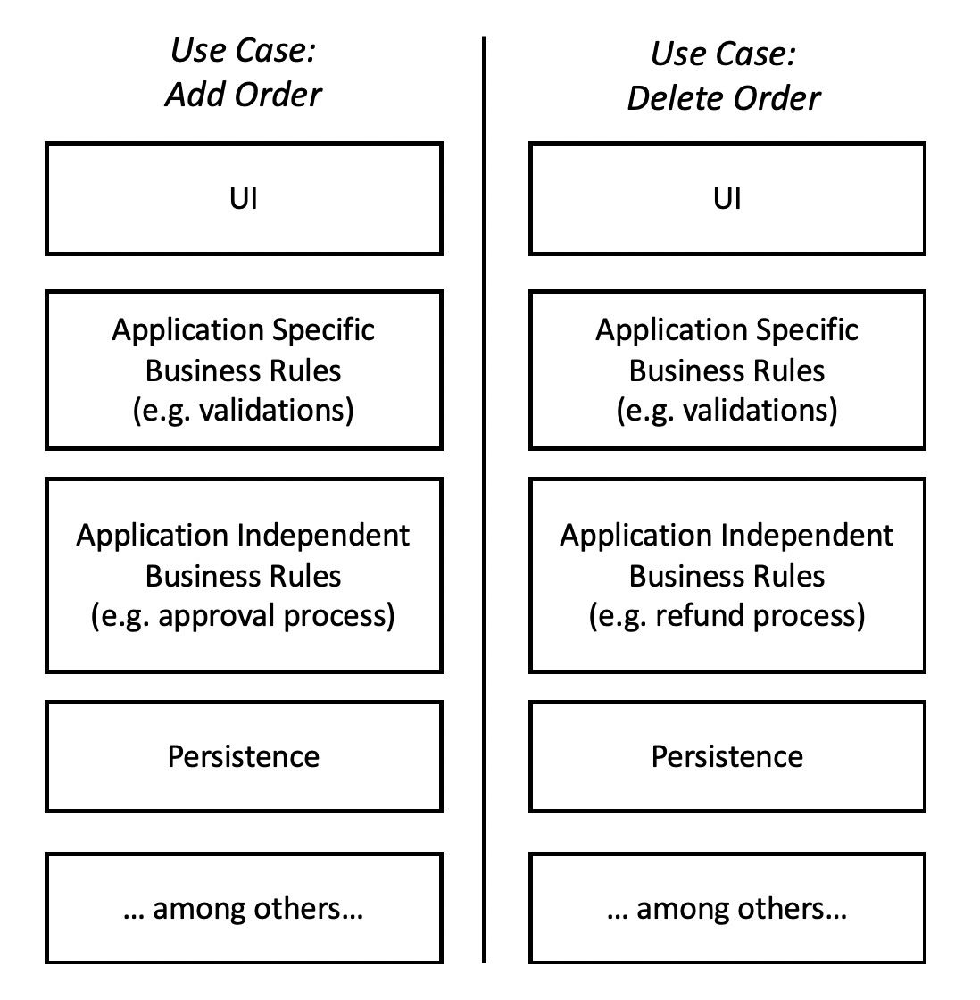
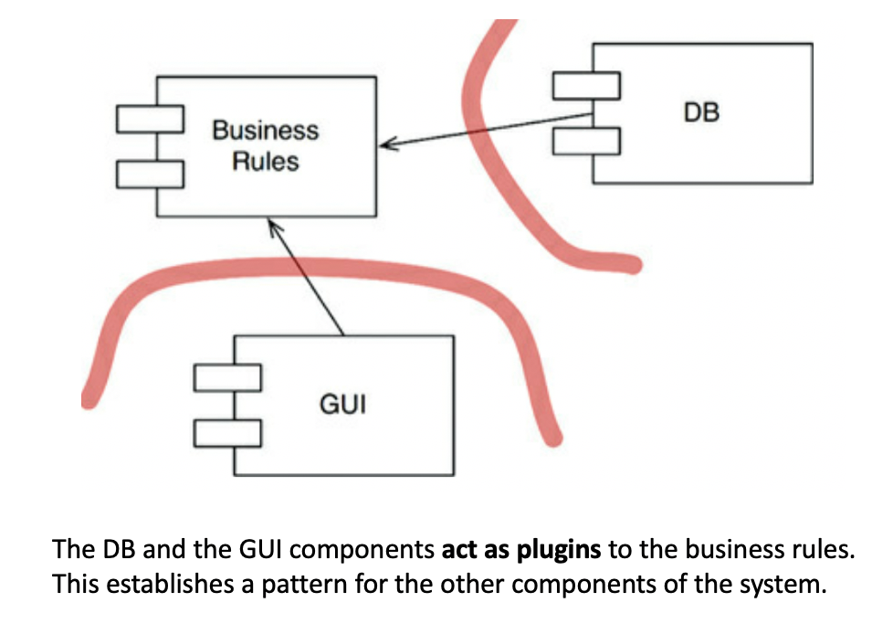
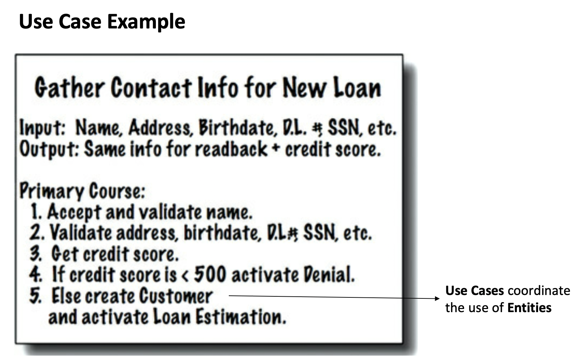

# Part V - 1 - Architecture

Note: this was divided into 2 files because it was getting too long.

## Chapter 15 - What is Architecture?

Software Architects should be programmers and should continue to
program. The continue taking on programming tasks while guiding the rest
of the team towards a design that maximizes productivity.
- Architects may not program as much as engineers, but they must
  continue doing so. They must experience the pains that their decisions
  cause.

The architecture of a software is the composition, shape, communication
mechanisms between the components that make the software. The purpose is
to facilitate **development, deployment, operation and maintenance**,
optimising to **minimize lifetime maintenance cost** and **maximize
programmer productivity.**
- The strategy is to **leave as many options open as possible**, for as
  long as possible.

The above entails that the *primary role* of architecture is NOT correct
behaviour of the system. Correct behaviour is a critical yet-secondary
priority.
- There are many systems out there that work correctly but that are very
  hard to maintain.

### Facilitate Development

The architecture must make it possible for the teams to organize as they
need without interfering with each other.

Jump ahead to
[Layers and Independent Develop-ability](#layers-and-independent-develop-ability)
to see how this is possible.

#### The Paradox of Small Teams

**Small teams** of say 5 developers can work effectively on a monolithic
system without well-defined components. Furthermore, they will probably
find the strict rules of architecture to reduce their productivity
during the early days of development. This is why so many systems lack
good architecture: They begun with none because the team was small and
did not want the impediment of a superstructure.

#### Large Teams

A system being developed by five different teams, each with seven
developers will not make progress until the system is divided into
well-defined components with stable interfaces.

If no one thinks about the architecture, the teams will naturally
gravitate to a 5-component architecture (one per team). This will likely
not be the best architecture for deployment, operation and maintenance.

### Facilitate Deployment

Ease of deployment of the **whole system with a single action** is often
overlooked, especially during early stages of development, and is a
critical concern of architecture.

The extreme case of neglecting ease of deployment is the blind early
adoption of a *"micro-service architecture"*. At first, the teams may
find it really easy to develop due to the strict boundaries and stable
interfaces, but deployment becomes a major challenge because of the need
for coordinated deploy between services, connection errors, etc.

Had architects considered ease of deployment early on, they might have
decided on fewer services, or a hybrid of network services and in
code-services that are more integrated.

### Facilitate Operation

Operation is seen from 2 optics in this section: **Operation Performance
in Hardware** and **Cognitive load to understand the what the software
does.** Architecture is more related to the second optic that to the
first one.

#### Operation Performance

For reasonably well programmed applications, performance problems can
almost always be solved by throwing more hardware at them. If the
architecture is good, it is rarely the cause of the performance problems
and does not get in the way of solving them.
- People are more expensive than hardware. Unless the performance is
  horrible, the cost of bad performance is typically much lower than the
  cost of hard develop-ability, deployment or maintenance.

Component arrangement to optimize performance should be treated
[as a detail whose decision's can be deferred](#good-architecture-keeping-options-open).
An architecture that maintains proper isolation of its components and
does not assume the means of communication between them makes it easy to
arrange the processing elements in a way that can be tuned for
performance: e.g. easily parallelize-able in different servers or
threads, independently deployable and scalable on different servers.

Jump ahead to
[Vertical layers and operation performance](#vertical-layers-and-operation-performance)
to see how this is possible.

#### Cognitive Load

**Cognitive easiness** of what the software does *is* the critical bit
from the operation point of view because it makes development and
maintainability easier.

### Facilitate Maintenance

Of all the aspects of a software system, maintenance is the most costly.

The main component of maintenance cost is in **speluking** and risk:
- **Speluking:** Digging through the existing software to figure out
  where to add a new feature or to correct a bug.
- **Risk:** convoluted software increases the risk of adding a bug while
  adding a new feature or correcting another defect.

A carefully though-through architecture vastly mitigates this costs and
**illuminates the pathway for future features.**

### Good Architecture: Keeping Options Open

> As we described in an earlier chapter, software has two types of
> value: the value of its behavior and the value of its structure. The
> second of these is the greater of the two because it is this value
> that makes software soft.

On a very high-level, software systems can be divided into 2 elements:
**policies** and **details.**
- **Policies:** business rules and procedures.
- **Details:** things that are necessary for humans and other systems to
  communicate with the policy but that not impact the policy at all
  (e.g. They include IO devices, databases, web systems, servers,
  frameworks, communication protocols, and so forth).

The goal of the architect is to create a shape for the software that
recognizes the policies as the main elements and keeping the details
irrelevant to them.

What are the options that we need to leave open for as much as possible?
*The details that don't matter*. Decisions on this can be delayed and
deferred. The longer you wait to make those decisions, the more
information you have to make the correct decision.

Some examples of leaving the options open:
- Selection of a DB does not need to happen in the early days of
  development. The policy should not care which kind of DB is used (or
  it may even use flat files).
  - This even goes as far as the query language and even the schema are
    technical details that have nothing to do with the policies
    (business rules).
- It is not necessary to choose the web server early. The *web* is a
  delivery mechanism that policy should be unaware of. Furthermore, the
  policy *could* be used in non-web systems without change.
- REST, GraphQL, SOA, micro-services. All of these things are interfaces
  to the outside world that the high-level policy is not concerned
  about. This decisions can be deferred.
- It is not necessary to adopt a dependency injection framework early in
  development, because the high-level policy should not care how
  dependencies are resolved.

Delaying and deferring the details also allows you to **experiment**
with say different databases, API styles or even frameworks to measure
performance and applicability without changing the policy.

What if your company has already committed to a detail? A good architect
pretends that the decision has not been made, and shapes the system such
that those decisions can still be deferred or changed for as long as
possible.

An amazing result of this type of thinking is that our programs become
**device and technology independent.**

## Chapter 16 - Vertical and Horizontal Layers and Independence

This chapter explores the idea of thinking about software systems as
horizontal and vertical layers and shows how that layered thinking
supports the architecture goals presented in the previous chapter:
Operation, Develop-ability, Deploy-ability (and implicitly
maintainability).

### Thinking in Layers

- **Vertical Layers:** related to what the system does (use cases). Use
  cases change for different reasons and different rates from each
  other, therefore, they should be protected from each other.
  - If we wanted to achieve perfect vertical layer decoupling, we need
    to separate the horizontal bits of each use case. For example, the
    *add-order* use case has its UI and DB code that is different from
    the *delete-order* one.
- **Horizontal Layers:** related to the functional purpose of the layer
  in the code (e.g persistence).

### Vertical Layers and Operation Performance

In any application, some use cases are used far more often than others
or have stricter performance requirements. The concept of vertical
separation by use cases enables a powerful idea: if we absolutely needed
to support high throughput for a particular use case, we already have a
natural place where to cut without too much changes as the software is
already modularized.

By making the vertical separation strict, avoiding any assumption that
other use-cases are accessible via the same machine, use-cases can be
deployed and scaled independently as *services* / *micro-services*. See
[Decoupling Modes](#decoupling-modes) for more details.

This idea of vertical separation **does not mean** that *micro-services*
are the way to go. The point of this section is to illustrate that a
well though architecture allows us to defer decisions about
[Operation Performance](#operation-performance) and **keep our options
open for when we have more information.**

### Layers and Independent Develop-ability

A good horizontal decoupling in which the business rules don't know
about the UI allows different teams (say FE and BE) to work in the UI
and the business rules without affecting each other.

Additionally, if we have good vertical decoupling, we could also arrange
our teams to work on a `use case` basis and have, for example, a team
working on `add Order` that never interferes with the team working on
`delete Order`.

**The point is, as long as the horizontal and vertical layers exist, the
system will support the team organizational needs for the company,
regardless if they want to work as feature teams, component teams, layer
teams, some other variation, or if they need to change the team
structure over time.**

### Layers and Independent Deploy-ability

Horizontal layers give us the possibility of, for example, compiling the
UI or persistence layers of a use-case independently from its business
logic. Changing the UI version is just a matter of swapping the jar
file.
- With horizontal layering, you *could* also deploy the FE in different
  servers if you wanted to. Again, a good architecture allows you to
  make this decisions later.

Vertical layers give us a similar possibility, and optionally we could
take it to the point of deploying to different *micro-services* as shown
in the
[Vertical Layers and Operation Performance](#vertical-layers-and-operation-performance)
section. See [Decoupling Modes](#decoupling-modes) for more details.

### The Fear of Duplication Trap

Many architectures get damaged because of the fear of duplication.

Duplication is generally considered a bad thing in software. However,
there is an important distinctions between 2 types of duplication:
- **True (bad) duplication** happens when the exact same code or logic
  is truly repeated in multiple places and every time a change happens,
  we need to change all places.
- **False (accidental) duplication** is where two apparently duplicated
  sections of code evolve along different paths, change at different
  rates and for different reasons.
  - Even if the code looks the same at some point in time, it will
    diverge over time.

Architectures get damaged when developers unify pieces of accidental
duplication because separating them as they take different paths is
really challenging.

Some examples of common accidental duplication scenarios that you should
avoid unifying:
- **Accidental duplication in vertical layers:** Similar views,
  algorithms, database queries or schemas across use cases.
- **Accidental duplication in horizontal layers:** the data structure of
  a database record near the persistence layer (e.g. the structure that
  represents a book record) is very similar to the data structure of a
  particular UI part (e.g. the view model for a book).
  - **Don't** pass the DB record to the UI. Create a separate view model
    and keep your layer decoupled.

### Decoupling Modes

**"Decoupling modes"** are different levels of actual decoupling we can
achieve by changing how components communicate with each other.

- **Source Level:** All the code is in one project in a single
  executable. The vertical and horizontal layers exist and the
  dependencies are controlled via the source code so that high-level
  components are protected from changes on low-level details. The
  components communicate via direct function calls. This is a well
  designed monolith.
- **Deployment Level:** Some of the layered components have been
  extracted to other projects and are distributed via a jars, gems or
  DLLs. The main program may include the jar and communicate with the
  component via direct function calls, or may run independently on the
  same machine and communicate via inter-process communication, sockets
  or shared memory.
- **Service Level:** Some of the components have been extracted to other
  projects and are deployed independently to potentially different
  servers or virtual machines. Components communicate with each other
  via network calls.

**Which one is best?**

It is hard to know at the beginning of the project and the best option
will change as the project matures. Therefore we need the architecture
to allow us to decide on this **later** without having to re-build the
whole system.

Note that as the decoupling mode becomes more strict, things like
component communication, testing and developing a new features become
much harder. We should move to stricter decoupling *only* if it is
really needed.

#### The pitfall of micro-services by default

It has become increasingly popular for teams to default to
micro-services* since day 1 of a project.

Dealing with distributed systems and network service boundaries is very
difficult. This is a waste of effort and resources when there is no good
reason to have two uses cases running in different services.

Additionally, the *micro-services by default* mindset tends to make
people think that the vertical layering at the micro-service level is
sufficient and internally the micro-services' code are *big balls of
mud.* In reality, it is likely that the internal code also needs some
vertical layering.

There is nothing intrinsically wrong with a software system that has
been architected around the idea of use-case services. Problems arise
when teams commit early to a **service-level DECOUPLING MODE** without
really needing it.

Note: in the context of this book, *micro-service "architecture"* and
*service-oriented "architecture"* are the same thing (they only defer on
a vague definition of lines of code per service). Also "architecture" is
in quotes because the decision of decoupling at the service level and
deploying in different servers is a **decoupling mode / topology**
decision, not an architecture.

See "[Are Services Boundaries?](#are-services-boundaries)" for more tips
on how to architect the relationships between boundaries.

See
[Chapter 27 - Services: Great and Small](part-5-2-architecture.md#chapter-27---services-great-and-small)
for a more extended discussion about Service Oriented "Architectures"
and Microservices.

#### Uncle Bob's Preferred Decoupling Mode Strategy

His preferred strategy is to push decoupling up to the point where
**service-level** decoupling *could* be performed without too much
effort only if it became necessary.

Initially all the code lives in one project, separated by **source code
level** decoupling. This makes interaction between components easy via
direct method calls. This may be sufficient for the whole lifetime of
the project.

If deployment or development issues arise, he extracts whatever use
cases are causing the issue to **deployment-level** decoupling to fix
the issues.

If performance operational issues appear, he carefully chooses which
components to turn into **services**.

Overtime, if performance needs reduce, he reverts the **service-level**
decoupling to **deployment** or even **source code** level.

Changing decoupling modes is tricky and Uncle Bob is NOT advocating for
systems that can run in any decoupling mode just by changing a
configuration. The point he is making is that the architecture should
make the changes of decoupling mode **possible** in both direction
(simple to complex and complex to simple).

## Chapter 17 - Boundaries: Drawing Lines

> Some of those lines are drawn very early in a project’s life—even
> before any code is written. Others are drawn much later. Those that
> are drawn early are drawn for the purposes of deferring decisions for
> as long as possible, and of keeping those decisions from polluting the
> core business logic.

**What makes a software difficult to maintain?** Coupling, especially
coupling to *premature decisions.*
- *Premature decisions* are decisions that hove nothing to do with the
  business logic / use cases. E.g. frameworks, data-bases, web servers,
  libraries , etc.

### Which lines do you draw, and when do you draw them?

> Draw lines between things that matter and things that don’t. The GUI
> doesn't matter to the business rules, so there should be a line
> between them. The database doesn't matter to the GUI, so there should
> be a line between them. The database doesn't matter to the business
> rules, so there should be a line between them.

Also draw lines between things that change at different times and for
different reasons. See
[The Common Closure Principle (CCP)](part-4-component-principles.md#the-common-closure-principle-ccp)
section for more details.

#### The relationship between the database and the business rules

Often people think that the database is inextricably connected to the
business rules. This is not true. The business rules only need to know
that there is a set of functions to fetch and save data, meaning that
the DB can be hidden behind an interface.
- Note that in a real application there would be many business rules
  classes, many databases interfaces and many classes that implement
  those interfaces to access the database. See
  [Thinking in Layers](#thinking-in-layers) for an example.

#### The role of the GUI in the system

People often thing that the GUI *is the system* and therefore should be
developed first. This is not true, the GUI is a simple *IO device*. The
system is the **set of business rules that drive it** and therefore they
should be developed first.

### The Plugin Architecture - The Foundational Idea of Clean Architecture

Making the DB and GUI act as plugins to the **business rules** we have
made it possible to implement and swap different GUIs (e.g web based,
SOA based, console based) and Databases (SQL, NoSQL, file system).

It is the business rules that determine which operations need to be
supported by whatever GUI and Persistence mechanism we decide to use and
it is up to those plugins to implement them.

Making these type of replacements most likely is not going to be
trivial. The point being made here is that by adopting the plugin idea
we at least have made this changes **possible.**
- Changes like these are impossible / impractical to do in systems in
  which the business rules have code that is tailored to a particular
  GUI or a particular Persistence technology.

## Chapter 18 - Boundary Anatomy

The boundaries that separate components in a software's architecture
come in man different forms. This chapter explore the most common types
of boundaries.

### What is boundary crossing?

In software, boundaries are crossed when a function on one side of the
boundary calls a function on the other side of the boundary.

Depending on the **decoupling mode**, this call can be an inexpensive
call to another function in the same project, a call to a function that
lives in a packaged jar or gem that is imported into our project, a call
via inter-process communication (e.g sockets or shared memory) or a full
network call.

### Boundaries and Monoliths

As mention in the [Decoupling Modes](#decoupling-modes) section,
boundaries can exist even if all the code is in the same project (a
monolith) using **source-level** decoupling.

Furthermore it is possible to have monoliths with no boundaries. Those
projects will suffer from develop-ability, maintenance, etc difficulties
despite having all the code in a single project.

Disciplined partitioning of code into components using boundaries can
greatly aid developing, testing and deployment of the project.

### Are Threads Boundaries?

> Threads are not architectural boundaries or units of deployment, but
> rather a way to organize the schedule and order of execution.

The calls that a threaded code makes may be entirely contained within a
component or spread across multiple components.

### Are Local Processes Boundaries?

Yes, a software that runs different parts in different local processes
has a strong *physical* boundaries between the processes that are
enforced by the operating system.

However, don't think that the process boundaries are the only boundaries
your software needs. To keep your architecture clean, think of a local
process as an uber-component:
- Internally, the code for each process should have an architecture that
  is decomposed into components using the ideas we've studied so far
  with the boundaries enforced via **source-level** decoupling.
- At the process-to-process level, the general idea of **plugin**
  architecture still holds. High-level processes must NOT depend on
  low-level processes; therefore, high-level processes must not contain
  the names of physical addresses of low-level process. Low-level
  processes should act as a **plugin** to the high-level processes.

#### Are Services Boundaries?

Yes, it is the strongest boundary. Services assume that all
communications take place over the network (even if they run on the same
machine).Communication is very expensive so calls that cross the service
boundary should be avoided if possible.

The general idea of **plugin** architecture also holds: low-level
services should act as a plugin to higher level ones.

See
[The pitfall of micro-services by default](#the-pitfall-of-micro-services-by-default)
for more information.

## Chapter 19 - Policy and Level

**Clean architecture's** fundamental idea of *higher-level policies
should not depend on low-level details* is supported on a notion of
**component level** that we have not explored formally yet.

A possible definition of a **component level** is the minimum number of
steps needed to reach either the input and the output. The larger the
number of steps, the higher the level.

**Why is this notion of level important?**

> Higher-level policies—those that are farthest from the inputs and
> outputs—tend to change less frequently, and for more important
> reasons, than lower-level policies. Lower-level policies—those that
> are closest to the inputs and outputs—tend to change frequently, and
> with more urgency, but for less important reasons.

## Chapter 20 - Business Rules

To divide our app into **business rules (policies)** and plugins, we
better know what business rules are.

There are several types of business rules. But the simple definition is
that a business rule is a procedure that helps the business make or save
money.

### Entities (Application-independent Business Rules)

There are procedures that would exist in the business even if they were
not automated and had to be executed manually. We call these procedures
**Critical Business Rules.**
- e.g. In a Bank, Loans have procedures to calculate interests and make
  payments.

**Critical Business Rules** need some data to work with. This data would
also exist even if the system was not automated. We call these
**Critical Business Data.**
- e.g. In a Bank, Loan procedures need a loan balance, interest rate,
  etc.

An entity is an object within our software that represents the union of
*critical business rules* operating on *critical business data* (i.e.
data bound to behaviour if you may). For example,the *Loan* entity could
look like:

| **Loan**           |
|:-------------------|
| -principle         |
| -rate              |
| -period            |
| :----------------- |
| +makePayment()     |
| +applyInterest()   |
| +chargeLateFee()   |

- The entity should either hold the *critical business data* OR have
  very easy access to it.
- The entity does not know anything about databases, user interfaces or
  third-party frameworks.
- In an object-oriented language the entity may be a class, but in other
  paradigms it can be whatever construct allows to bind data and
  behaviour together (all programing paradigms have this concept).

### Use Cases (Application-specific Business Rules)

They are business rules that make or save money by defining the way the
*automated* system operates. They wouldn't exist if the business
operated in a manual environment.

For example, the bank application may not allow the bank clerk to
proceed to the bank payment estimation screen, until the client's
contact information and credit score have been gathered and validated.

**Important points about use cases:**

- Each use case is a description of the way the system is used.
- They specify the input provided by the user, the processing steps and
  the output returned.
  - It uses other data elements to represent input data and output data.
    See [Requests and Response Models](#requests-and-response-models).
- They specify how and when the
  [Entities'](#entities-application-independent-business-rules) Critical
  Business Rules are invoked.
  - Entities have no knowledge of the use cases that control them.
    Entities are at a higher-level than use cases and therefore **do not
    depend** on them.
- It does NOT describe the user interface. It only specifies the data to
  be passed in. Use cases don't know if they are part of a web-system, a
  desktop client, etc.
- A use case is an object that has one or more functions that implement
  the application-specific business rules.

#### Requests and Response Models

Since we want the use case to get input data and return output without
coupling them to any particular type of I/O device (like the web or the
DB), we need to introduce simple (non-web related) **Request** and
**Response** data structures. These structures **should not depend on
anything**:
- They should not know about the web or the DB.
- They should not know about the framework.
- They should not contain references to Entity objects.
  - Despite probably sharing data with Entity objects, **the purpose of
    these two objects is very different and they will change for very
    different reasons.** Therefore this is
    [accidental duplication](#the-fear-of-duplication-trap) and it is
    better to keep them separate.

Not complying with the above will result in your use cases indirectly
depending on things like the web or the framework.

## Chapter 21 - Screaming Architecture

Software architectures are structures that support the use cases of the
system. As such, when someone takes a look at the top-level directory of
a project, it should be evident what the use cases of the system are
(i.e. what it is about).

The following things are often mistaken as an architecture, but they are
not:
- **The Web:** The web is a delivery mechanism (an IO device). Your
  architecture should treat the fact that it is delivered via the web as
  a detail.
- **Frameworks:** frameworks and the structures they impose are not an
  architecture. Frameworks authors and their community tend to be true
  believers of them and assume a "let-the-framework-do-everything"
  position. This is not the position we want to take. Frameworks help,
  but that comes at a cost that may not be worth paying. **Preserve the
  use case emphasis of your architecture and develop a strategy in which
  you can use a framework without it taking over your architecture.**

### Testable Architectures

A use-case centric architecture that has kept the framework and other
details at arms-length will be easy to unit-test without having to have
any frameworks, web-servers, databases running.
