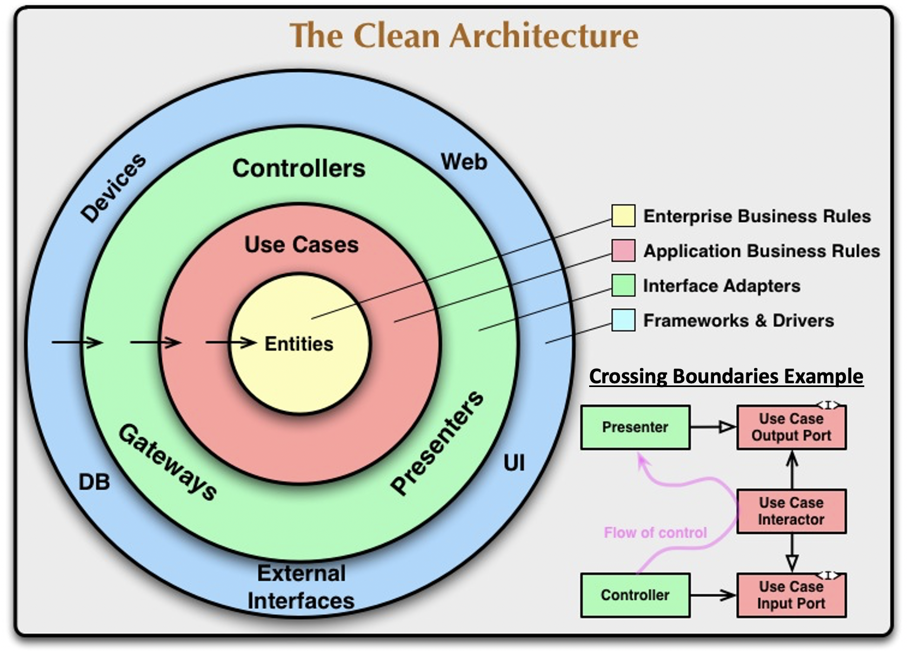
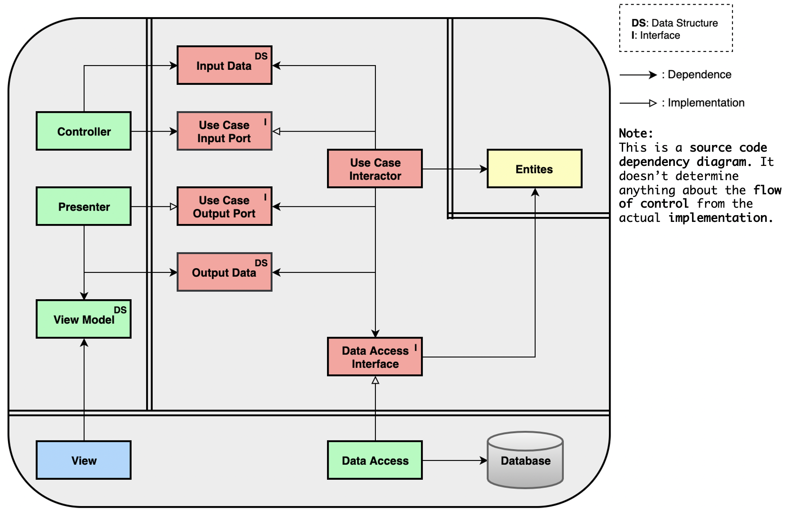
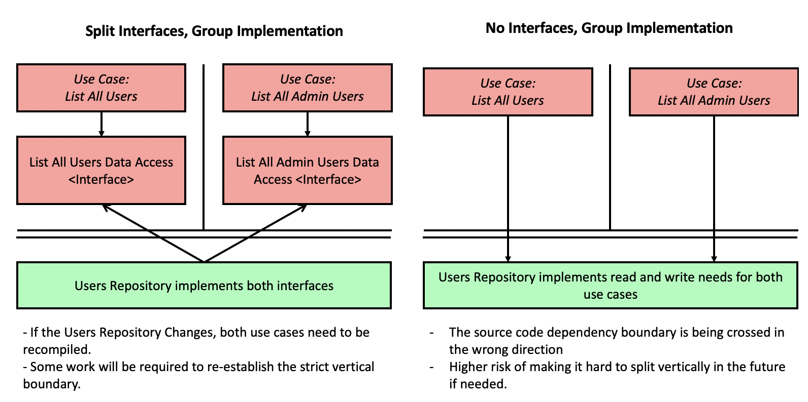
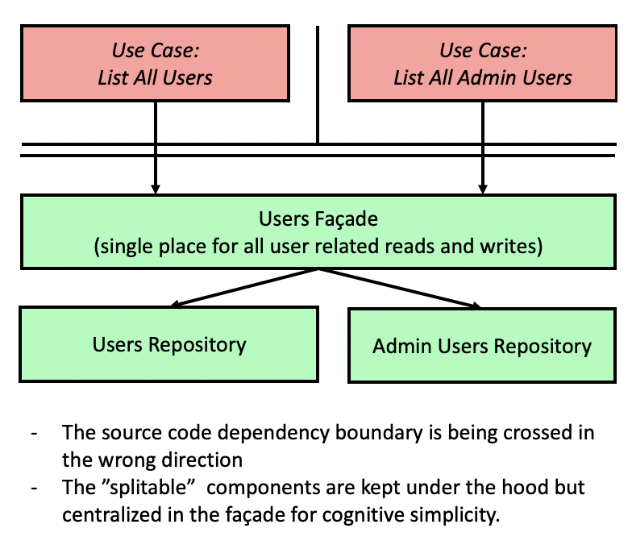
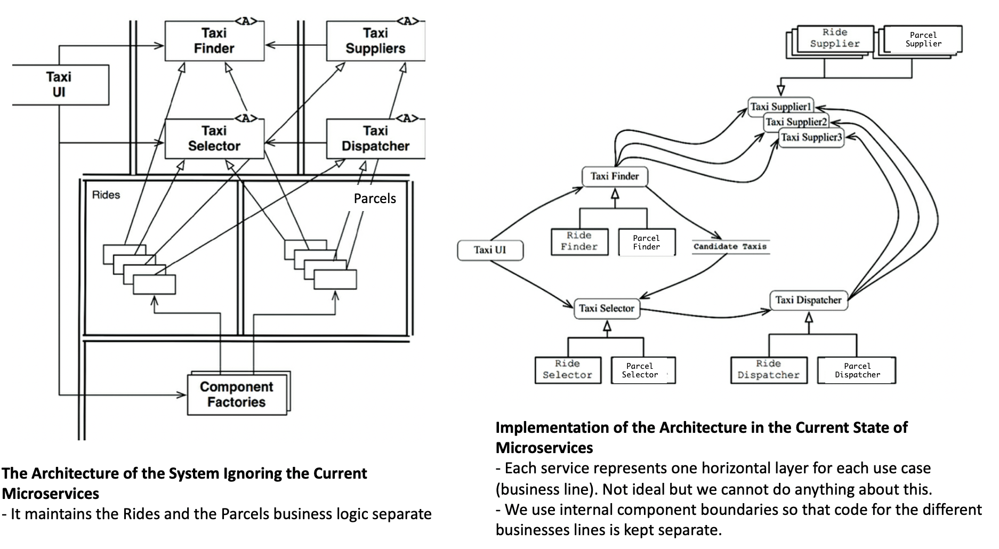

# Part V - 2 - Architecture

Note: this was divided into 2 files because it was getting too long.

## Chapter 22 - The Clean Architecture

Hexagonal Architecture (aka ports and adapters), DCI, BCE are all
architecture structures that have this common set of characteristics
(they vary a little in their details):
- **Independent of frameworks**
- **Testable**: business rules are testable without the UI, the DB, the
  web server, and any other external element.
- **Independent of the UI:** The UI can change easily with no impact to
  the business rules. The UI can easily be replaced.
- **Independent of the database**
- **Independent of external agents:** The business rules don't know
  anything about interfaces to the outside world.

**The clean architecture** is an attempt at integrating all these
architectures in to a single actionable idea:



Next we will explore different aspects of this idea.

### Breakdown of the Clean Architecture

#### The Dependency Rule

> Source code dependencies must point only inward, toward higher-level
> policies.

- Nothing in an inner circle can know anything about something on an
  outer circle.
- Data formats declared in an outer circle should NOT be used by an
  inner circle (especially if those formats are generated by a framework
  in an outer circle).

#### Entities

> Entities encapsulate enterprise-wide application-independent Critical
> Business Rules. An entity can be an object with methods, or it can be
> a set of data structures and functions.

The are at the highest level. No operational changes to an application
(e.g. visual or security changes) should affect this layer.

- If you work in an enterprise with different applications, entities can
  be used by many different applications.
- If you are only working with a single app, entities are the business
  objects of the app.

#### Use Cases

They are *application-specific* business rules. We do expect certain
changes to the operation of the software (particularly on how it is
used) to cause changes in this layer.

They control the dance of the `Entities` and also use the `Data Access
Interfaces` to fetch the data used by those Entities into memory from
the `Database`. See the
[Use Cases (Application-specific Business Rules)](part-5-1-architecture.md#use-cases-application-specific-business-rules)
for more details.

#### Interface Adapters

They are responsible for converting data from the format most convenient
for the use cases and entities, **to the format most convenient for some
external agency such as the database or the web.**

##### UI Interface Adapters

This layer fully contains the UI-MVC: presenters, views-models and
controllers.

Interaction with the use cases:
- On the way into the use cases: controllers pass data into the use
  cases wrapped into some data structures whose interface is determined
  by the use case layer and implemented by the interface adapter layer.
- On the way out of the use cases: presenters wrap data returned by the
  use case and adapts it to the view.

##### DB Interface Adapters

Converts data from the form most convenient for entities and use cases,
to the form most convenient to whatever persistence mechanism is being
used (e.g. the database).

- Nothing inwards from this layer know about the database.
- If the database is relational, the SQL code is restricted to this
  layer.
- E.g. repositories go in this layer implementing an interface
  determined at the use case level.

##### External Service Interface Adapters

Similar than from the DB, this layer converts the data from the form
that is convenient to the external service, to the form that is
convenient to the use cases and entities.

#### Frameworks and Drivers

- Contains things like the actual database or the web framework.
- We dont generally write much code in this layer since most of the
  components are libraries.
- Perhaps the only code we need to write is some glue code to
  communicate to the circles inwards.

#### Can I use more than four layers?

Yes, you may find you need *more* layers for you software. The Clean
Architecture Layers are meant to be schematic. However, the *dependency
rule* still applies: higher-level things go on the inside and
dependencies should only point inwards.

#### Crossing Boundaries

The diagram above shows an example on how to cross the boundaries. Note
the usage of
[Dependency Inversion](part-3-design-principles.md#chapter-11---the-dependency-inversion-principle)
to ensure that source code dependencies always point to higher-level
layers. Also note that the source code dependency direction is
independent from the flow of control (aka flow of execution) direction.

##### Which Data Crosses the Boundaries

Data crosses boundaries in simple data structures. All of these forms
are acceptable:
- Structs.
- Simple data transfer objects (e.g. value objects).
- The data can simple be the arguments in function calls.
- Data packed into hashmaps (aka Ruby hashes).

The data should always be in the form that is most convenient for the
inner circle (higher-level layer).

Common violations of these are:
- Passing Entity objects (TODO: Clarify with some examples).
- Having the DB framework pass some sort of automated "row structure"
  created as a result of a query into the use case (e.g. pass in active
  record objects into the use cases).

### When should I use and not use the Clean Architecture?

Note: This section is not en the book. However, Mr. Martin makes
reference to this in different parts of the book.

**There is an inherent tradeoff between how easy a project is to change
and maintain and it's simplicity.** This in turn translates into a
tradeoff between
[the Cost of Implementing VS Ignoring Boundaries](#chapter-25---the-cost-of-implementing-vs-ignoring-boundaries).

[Chapter 25 - The Cost of Implementing VS Ignoring Boundaries](#chapter-25---the-cost-of-implementing-vs-ignoring-boundaries)
gives some high-level guidance on how to use a cost-driven approach to
determine which boundaries need to be there, which can be
[partially implemented](#chapter-24---partial-boundaries) and which can
be ignored. However, we offer some practical guidelines on the types of
projects that tend to benefit from implementing The Clean Architecture
VS the types of projects for which it is over-engineered and ends up
hurting them.

#### When to use it

- Long running multi-year projects that should be able to keep up with
  technology changes (e.g. changes databases or frameworks).
- Projects that need to support multiple I/O devices (e.g. web, console
  and desktop).
- The project needs to be worked on by multiple teams of developers
  (e.g. 4+ teams).
- When you *think* you might need to evolve your decoupling mode into
  [Service Level / Service / Microservice decoupling](part-5-1-architecture.md#the-pitfall-of-micro-services-by-default)
  but you want to deffer that decision as much as possible.
  - This service level decoupling desire should be driven by data of
    which use cases are used more or are expensive that warrant
    independent deployment and scalability.
- You are dealing with a domain that has a high inherent complexity to
  it.
- Your project will be subject to a lot of change and you are unsure
  what that changes will be.
- The stakes of getting it wrong are high.

Note that we can apply the Clean Architecture idea to *parts* of the
system to protect business rules from things that are likely to change.
What is likely to change depends on your business. For example, we could
protect the business rules from the UI with a strict boundary but accept
that the changing the backing database is unlikely and therefore we can
tolerate a less strict
[partial boundary](#chapter-24---partial-boundaries).

#### When not to use it

- Simple CRUD web-based systems.
- On domains with little inherent business complexity.
- The project will ever be worked on by a single small team.
- The system will not require much change after it is created and
  released.
- The team is not **skilled enough or convinced enough**. You may want
  to run workshops to upskill them but ultimately, if there is no team
  buy in, this can cause frustration.

### A web application example

The diagram below shows how the clean architecture could be used in the
context of a request response cycle of a database backed web
application.



Uncle Bob explains how this works clearly in the book:

> The Controller packages that data into a plain old Java object and
> passes this object through the InputBoundary to the UseCaseInteractor.
> The UseCaseInteractor interprets that data and uses it to control the
> dance of the Entities. It also uses the DataAccessInterface to bring
> the data used by those Entities into memory from the Database. Upon
> completion, the UseCaseInteractor gathers data from the Entities and
> constructs the OutputData as another plain old Java object. The
> OutputData is then passed through the OutputBoundary interface to the
> Presenter.
>
> The job of the Presenter is to repackage the OutputData into viewable
> form as the ViewModel, which is yet another plain old Java object. The
> ViewModel contains mostly Strings and flags that the View uses to
> display the data. Whereas the OutputData may contain Date objects, the
> Presenter will load the ViewModel with corresponding Strings already
> formatted properly for the user. The same is true of Currency objects
> or any other business-related data. Button and MenuItem names are
> placed in the ViewModel, as are flags that tell the View whether those
> Buttons and MenuItems should be gray.
>
> This leaves the View with almost nothing to do other than to move the
> data from the ViewModel into the HTML page.


Note that this example assumes that we want to maintain strict
architectural boundaries between the layers and therefore represents an
ideal case. In
[Chapter 24 - Partial Boundaries](#chapter-24---partial-boundaries),
Uncle Bob discusses the cost of maintaining strict boundaries and offers
some ways of introducing less strict boundaries that *could* become
strict if needed.

#### Sample Code

The code below contains a possible pseudo-code implementation of the
architecture above.Only the parts that can cause confusion are shown,
the others I think are fairly obvious.

Note that this code is only schematic. These are a couple of things to
consider when reading this code:
- The classes could be decoupled further by using dependency injection
  frameworks,
  [`Abstract Factories`](part-3-design-principles.md#abstract-factories)
  among other patterns. As with everything with software, whether you
  want to use these other techniques or not... **it depends** on your
  situation.
- The code below assumes that the `Presenter` is the entrypoint to all
  view-related logic and that it is capable of rendering the html
  templates. There are benefits to this approach. However, most web
  frameworks like Rails make the controller actions determine which html
  template needs to be rendered.
  - In this case, the controller code changes slightly. See
    [the discussion about option#1 and option#2 on this Stack Overflow post](https://softwareengineering.stackexchange.com/questions/357052/clean-architecture-use-case-containing-the-presenter-or-returning-data)
    for more information about these approaches.
- The names of the classes were selected to match the diagram. In a real
  application, this names will match concepts from the domain.

##### The Controller Action

```java
public void controllerAction(Params params) {
    // Typically pre-configured and injected into the controller
    // Shown here for clarity
    Presenter presenter = new Presenter();
    Repository repository = new Repository();    
    UseCase useCase = new UseCase(presenter, repository);

    InputData inputData = new InputData(name: params.name, email: params.email);
    // This assumes that the injected presenter takes care of rendering the view.
    useCase.doSomething(inputData); // Usage of the input port
} 
```

##### The Use Case and the Use Case Input and Output Ports

```java
interface UseCaseInputPort {
    public void doSomething(InputData inputData);
}
```

```java
interface UseCaseOutputPort {
    public void present(OutputData outputData);
}
```

```java
class UseCase implements UseCaseInputPort {
    private Repository repository;
    private Presenter presenter;

    public UseCase(Repository repository, UseCaseOutputPort presenter) {
        this.repository = repository; // Implements Data Access Interface
        this.presenter = presenter;
    }

    // Use Case Input Port
    public void doSomething() {
        Data data = this.repository.getData();
        Entity entity = new Entity(data);
        Integer someResult = entity.someBusinessRule();
        OutputData outputData = new OutputDAta(someResult);
        // #present is the Use Case Output Port 
        this.presenter.present(outputData);  
    }
}
```

##### The Presenter and The View Model

```java
class Presenter implements UseCaseOutputPort {
    public void present(OutputData outputData) {
       String formattedDate = formatDate(outputData.date());
       // ... other formatting
       ViewModel viewModel = new ViewModel(date: formattedDate);
       render 'some/template', viewModel
    }
    
    private String formatDate(Date date) {
        // ... formatting
    }
}
```

```java
class ViewModel {
    public ViewModel(OutputData outputData) { 
        // basically holds strings and booleans flags 
    }
}
```

## Chapter 23 - Presenters and Humble Objects

### The Humble Object Pattern

This pattern helps us identify and protect architectural boundaries. The
Clean architecture extensively uses the *Humble object pattern* to do
just this.

Starting with code that is very hard to test (like a GUI), the pattern
makes the thing that is hard to test as dumb as possible (i.e. *humble*)
by pulling out things that are easy to test into a separate class.

For example, a GUI can be split into a *presenter* and a *view* (a form
of *Humble object*) that is very dumb. This makes it very easy to test
all the GUI content via the presenter without actually having to render
the GUI. The view is so dumb that it is not even tested automatically.

### More on Presenters and View Models and Views

`Presenters` format everything and dump the result of that formatting
into a `View Model` data structure that contains Strings, boolean flags
and enums.

These are some things that the `Presenter` places into the `View Model`:
stringified dates, stringified currencies, currency color, labels for
buttons, if buttons should be disabled or not, menu items, names for
every radio button, check box and text fields, tables, etc...

The `View` **only** loads data from the view model.

**Note:** in practice, this seems very hard and impractical to implement
without library assistance. It would require some `Presenter-View
Model-View` library to help reduce the amount of boilerplate code that
this will create.


### Where do Data Mappers and ORMs go?

They go in the **Database Gateway** layer and are in service of
implementing the `Data Access Interface` required by the **Use Case**.
Only a dumb data structure whose format is defined by the use case layer
crosses the boundary. Needles to say, this data structure object does
not carry any further connection to the database.

### Where do calls to external services go?

They follow a similar structure to **Database Gateways.**


## Chapter 24 - Partial Boundaries

Fully-fledged strict architectural boundaries result the creation of a
lot of `interfaces` and `data structure` classes to maintain. Sometimes,
this can be judged as too complex or too expensive to build in light of
the specifics of the project. See
[the next chapter](#chapter-25---the-cost-of-implementing-vs-ignoring-boundaries)
for more information of when to use these.

For those cases, we might want to introduce a **Partial Boundary**. A
partial boundary allows us to reduce the complexity (in terms of number
of files) but ideally still leaves room to upgrade to a strict boundary
if needed.

Note that all partial boundaries are open to degradation if developers
are not disciplined. Therefore, there might be some work required to
upgrade it to a strict boundary.

Note that as a general rule of thumb, code from outer layers should be
compromised with partial boundaries first.

Uncle Bob offers 3 examples of how to introduce partial boundaries.
There are many more ways.

### Partial Boundary 1: Use Source Level Decoupling Mode

Of the 3 techniques offered, this is the one that compromises the least
in terms of boundary strictness.

It is basically doing all the coding work to achieve true
[Source Level Decoupling](part-5-1-architecture.md#decoupling-modes) but
not taking the step into
[Deployment Level Decoupling](part-5-1-architecture.md#decoupling-modes).

Source Level decoupling is significantly cheaper than deployment level
because there is no multi-package version tracking or release / build
management burden.

However, since the code is still in the same project, it is easy for
developers to weaken the boundary by making source code imports that
cross the boundaries in the wrong direction.

### Partial Boundary 2: Group Service Interfaces or Implementations

This is better explained through an example. Imagine we are implementing
a `ListAllUsers` use case.

In a strict implementation that separates both vertical and horizontal
layers, we would declare a `ListAllUsersDataAccessInterface` that
requires the implementation of `#listUsers`. In turn, we would create a
`ListAllUsersRepo` that implements `ListAllUsersDataAccessInterface` and
actually makes the query to the DB. So far we have 3 files.

Now imagine we also want to create the `ListAllAdminUsers` use case. In
a strict implementation, this will result in another interface and
another repository files to be created.

We now have 6 files in total (not counting tests). This is perfect
vertical separation, but a lot of code to maintain.

We could reduce the number of files by for example keeping the interface
declaration separate but declaring a single `UsersRepository` that
implements all interfaces.

Vertical separation is lost and moving into deployment level decoupling
is no longer immediately possible. However, it shouldn't be too hard to
refactor out back into vertical slices if needed.

We can reduce the file number even more by avoiding the interfaces
altogether. However, the compromises here are larger and the risk of
losing control of the boundary is also higher.



See
[Chapter 33 - Case Study: Video Sales](part-6-details.md#step-2-create-a-preliminary-component-architecture)
for a practical example of this partial boundary.


### Partial Boundary 3: Reduce Cognitive Load Introducing a Facade

In Part III, we saw how
[Facades](part-3-design-principles.md#approach-2-use-class-as-facade)
can be used to reduce the cognitive load of having to deal with many
small classes.

The next diagram shows that that pattern can be used to introduce a
partial boundary. It also comes with the compromise of boundaries being
crossed in the wrong direction and risk of losing control of the
boundary.




## Chapter 25 - The Cost of Implementing VS Ignoring Boundaries

This chapter shows an example of how Clean Architecture thinking can be
applied to a simple game that has increasingly complex requirements and
how that leads to discovery of potential boundaries that didn't look
apparent.

The points being made here are:
- Even for simple programs, we can come up with many architectural
  boundaries everywhere if we try hard enough.
- Software architecture has an unfortunate inherent trade-off between
  the cost of implementing boundaries VS the cost of ignoring them.
- Implementing a strict boundary when the software is simple and the
  boundary could be ignored is costly and leads to over-engineering.
- Implementing a boundary after we have ignored one is costly and risky.
  Also, permanently ignoring one where it is needed makes the project
  costly to maintain and change.
- **So what do we do?** We weigh the costs and risks of implementing vs
  ignoring to determine where architectural boundaries lie, which should
  be strict, which can be [partial](#chapter-24---partial-boundaries)
  and which can be ignored.
- Note that this is not one time decision. As the project evolves, we
  watch what things are causing friction in the development and
  maintainability and could use a boundary.
  - Our goal is to implement the boundary at the point where **the cost
    of implementation is less than the cost of ignoring.**


## Chapter 26 - The Main Component, The Ultimate Detail

> In every system, there is at least one component that creates,
> coordinates, and oversees the others. I call this component `Main`.

Under the *Clean Architecture*, `Main` is the outer-most layer and is
the lowest-level plugin to the application. This layer is not depicted
in the diagram shown in
[Chapter 22 - The Clean Architecture](#chapter-22---the-clean-architecture).

The job of `Main` is:
- Create all Factories, Strategies and other global facilities, then
  hand over control to the high-level portions of the system.
- The dependency injection framework should inject dependencies into
  `Main`. Then `Main` should distribute those dependencies just using
  code (without a framework).

Since main is a plugin, it is possible to have many `Main` components,
one for each configuration of your app. For example:
- `Main` for `Dev` another for `Test` and another for `Production`.
- One `Main` for every deployment region of your business.


## Chapter 27 - Services: Great and Small

This chapter expands on the ideas exposed in
[Chapter 16 - Vertical and Horizontal Layers and Independence](part-5-1-architecture.md#chapter-16---vertical-and-horizontal-layers-and-independence)  
but purely focused on services (i.e. a service-level decoupling mode). I
recommend you read that chapter first.

Service-oriented "architectures" and microservices have become popular
recently due to 2 reasons:
- Services *seem* to be strongly decoupled from each other. As we shall
  see, this is only partially true.
- Services *appear* to support independence of development and
  deployment. Again, as we shall see, this is only partially true.

### Are Services an Architecture?

Services are really a
[Decoupling Mode](part-5-1-architecture.md#decoupling-modes), not an
architecture in itself.
- Sometimes services *are* architecturally significant. This happens
  when a well defined architectural component has been decoupled as a
  service.
- Applications can have ill-conceived services, where they do not have
  architectural relevance. In these cases, the system is polluted with
  expensive network calls between undefined boundaries (e.g. distributed
  monoliths).
- Services ***don't have to be** architecturally relevant. There are
  legitimate reasons to have code running in independent services. This
  chapter only focuses on services that are architecturally significant.

The point is, the services **do not define the architecture.**

### Are the Benefits of Services Real?

#### The Decoupling Hype

One of the supposed benefits of breaking a system into service is its
strict decoupling which enforces no shared memory and well defined
interfaces between services.

This is only partially true:
- Separate services can still be coupled by the structure of the data
  they pass to each other. If a field is added to a record in one place,
  all other services get that data passed in need to change. Also, the
  meaning of each data field in each service needs to be the same
  (conceptual coupling).
- Services that share a database are coupled by both the schema and the
  "shared memory" that the data represents.
- The benefits of strictness of network interfaces are true, but this is
  also true for function calls that have been given the correct
  visibility attributes.

#### The Independence of Development and Deployment Hype

The points above also mean that the idea of independent development and
deployment are also only **partially true**. For example, if services A
and B share the database or the data format that is passed, when Service
A changes the database schema, then Service B needs to change and the
deployment needs to be coordinated.

### The Pitfall of Services by Functional Decomposition

A naive strategy for deciding how to divide a system into independent
services is divide them **by function** (aka functional decomposition).
For example, in a ride-sharing application like Uber, the engineers
could create the following microservices:
- Ride Finder Service: keeps the inventory of all possible rides.
- Ride Selector Service: Selects the best ride for the user given its
  constraints on location, cost, time, luxury, etc.
- Ride Dispatcher Service: Once selected, orders the ride.

This type of decomposition is that it is a **"purely horizontal"**
division and completely ignores
[the vertical layers](part-5-1-architecture.md#chapter-16---vertical-and-horizontal-layers-and-independence)  
that are based on use cases.

The problem with this division is that it is very hard to change in
light of cross-cutting feature changes (changes that require to touch
everything from the UI to the DB). For example, if the Uber marketing
team now wanted the business to offer delivery of small parcels
(something conceptually very similar to delivering people), the
engineering team would be forced to modify **every single
microservice**. Even worse, they face the risk of breaking the **people
delivery** part of the business while working on the **parcel delivery
part**.


### Services by Vertical Layers

A solution to the problem before is to divide services by vertical
layers (Use Cases or groups of Use Cases) and have each service contain
contain all functional concern it needs (all the horizontal layers).

The horizontal layers within each service are separated by architectural
boundaries and follow the dependency rule.

Note that doing this requires the code to be divided vertically very
early on. If you are in a situation where you already have microservices
divided by functional decomposition, transforming the system to
microservices by vertical decomposition might be impossibly expensive to
do. However, not all hope is lost.


### Distributed Vertical Layers

If you already are in a situation where your system has microservices
divided by functional decomposition, there are still things you can do
to make it easier to change in the light of cross-cutting changes. The
next diagram summarises the idea.




## Chapter 28 - The Test Boundary

Tests are part of the architecture of a system. The good news is that
from the point of view of the architecture, unit tests, integration
tests, behaviour tests...etc... all look the same. They all are
detailed, low-level components that always depend inward to the code
being tested. In a way, tests are the outermost circle of the clean
architecture.


### Design for Testability

Testing should be part of the considerations when designing a system.
Not considering tests as part of the design is a mistake that leads to
**fragile tests** that are expensive to maintain and often end up
getting discarded.

**Fragile test problems** occur when tests depend on *volatile things*
(like the GUI) to test *stable things*. For example, writing GUI driven
tests to test *business rules* can cause many use case tests to break
when unrelated changes in the GUI happen.

To avoid these problems, design the system and the tests so that
business rules can be tested without using the GUI (or other volatile
things). The way Uncle Bob recommends to do this is to create a testing
API that has "superpowers". These super powers include avoiding security
constraints, bypassing expensive resources such as databases and allow
developers to force the system into particular testable states.

### The Pitfall of Structural Coupling

Uncle Bob claims that having the test suite structurally map the
production code (e.g. one test file for every class and tests for every
public method) is problematic.

Structural coupling of tests makes the production code hard to change
because the tests must change to follow the structure.

Over time, structural coupling limits the necessary independent
evolution that tests and production code should undergo: Tests suites
should naturally become more concrete and specific over time, whereas
production code should naturally become more abstract and general.


## Chapter 29 - Clean Embedded Architecture

> It is not uncommon for embedded software to be denied a potentially
> long life due to being infected with dependencies on hardware.

Firmware is software that is tightly coupled to the hardware it runs on.
This coupling results in the need to re-write when the hardware changes.

Hardware changes at a very fast pace. To shield businesses from this,
firmware engineers should be writing more *software* (code that has been
isolated from the hardware it runs on) and less *firmware*.

### App-titude Test: The problem with just making it work

A general software good practice is:

> 1. “First make it work.” You are out of business if it doesn't work.
> 2. “Then make it right.” Refactor the code so that you and others can
>    understand it and evolve it as needs change or are better
>    understood.
> 3. “Then make it fast.” Refactor the code for “needed” performance.

Many engineers stop at "making it work" (aka the app-titude test) and
never go beyond that.In embedded software in particular, often 1 and 3
are done together and 2 is never considered.

### The Target-Hardware Bottleneck Problem

> There are many special concerns that embedded developers have to deal
> with that non-embedded developers do not—for example, limited memory
> space, real-time constraints and deadlines, limited IO, unconventional
> user interfaces, and sensors and connections to the real world.

Yes, embedded software has to run in special constrained hardware.
However, embedded software *development* is not SO special; the
principles of clean architecture still apply.

In embedded systems, you know you have problems when you can only test
your code on the target hardware (as opposed to being able to test the
business rules of your code independent of the hardware). This is known
as the *target hardware bottleneck problem*. **A clean embedded
architecture is a testable embedded architecture.**

### Building clean embedded architectures

The rest of this chapter explains some rules for creating clean embedded
architectures that follow the general ideas of the book (no new content
is introduced).

I recommend you read the chapter if you are interested in how the clean
architecture ideas look in the embedded software world.
